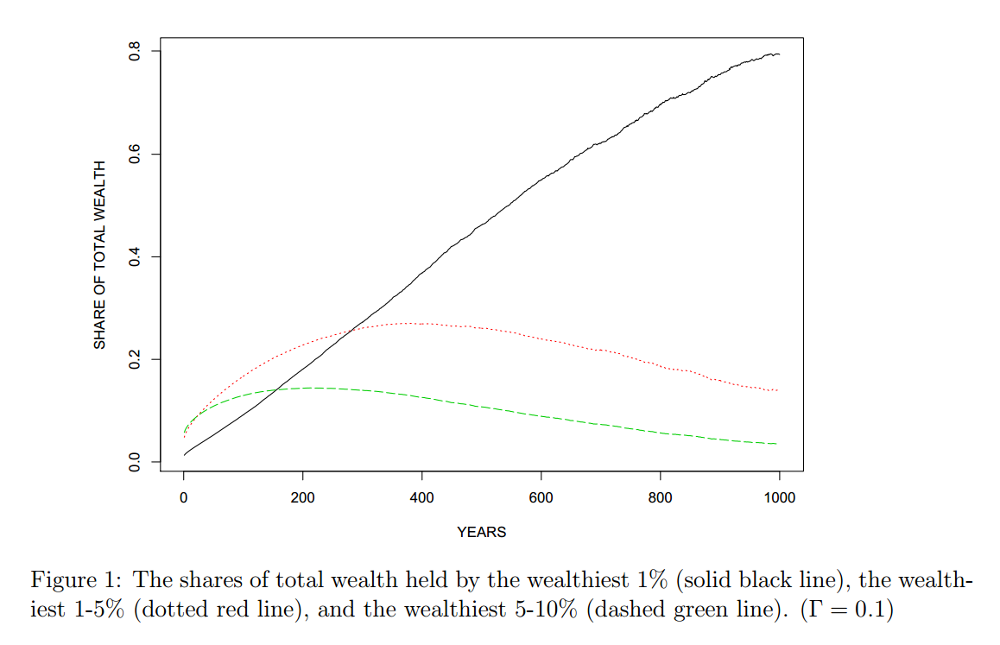

# Why Are You Here?

--- 

### Forbes 400 (2013) | How They Made Their Money?

```{r}
require(rCharts);require(rjson)

#modify show without reinstall to fix the height
Dimple2 <- setRefClass(
  "Dimple2",
  contains = "Dimple",
  methods = list(
    initialize = function(){
      callSuper(); 
    },
    #override the show here
    show = function (mode_ = NULL, ...) 
    {
        mode_ = getMode(mode_)
        switch(mode_, static = {
            viewer = getOption("viewer")
            if (!grepl("^http", LIB$url) && !is.null(viewer)) {
                temp_dir = tempfile(pattern = "rCharts")
                dir.create(temp_dir)
                suppressMessages(copy_dir_(LIB$url, file.path(temp_dir, 
                    LIB$name)))
                tf <- file.path(temp_dir, "index.html")
                writeLines(.self$render(..., static = F), tf)
                viewer(tf)
            } else {
                writeLines(.self$render(..., static = T), tf <- tempfile(fileext = ".html"))
                if (!is.null(viewer)) {
                    viewer(tf)
                } else {
                    browseURL(tf)
                }
            }
        }, server = {
            shiny_copy = .self$copy()
            shiny_copy$params$dom = "show"
            assign(".rChart_object", shiny_copy, envir = .GlobalEnv)
            if (packageVersion("shiny") > 0.7) {
                brwsr <- getOption("viewer", interactive())
            } else {
                brwsr <- getOption("shiny.launch.browser", interactive())
            }
            shiny::runApp(file.path(system.file(package = "rCharts"), 
                "shiny"), launch.browser = brwsr)
        }, inline = {
            add_ext_widgets(lib)
            return(.self$print(...))
        }, iframe = {
            chunk_opts_ = opts_current$get()
            file_ = knitr:::fig_path(".html", chunk_opts_)
            if (!file.exists(dirname(file_))) {
                dir.create(dirname(file_))
            }
            cdn = !(chunk_opts_$rcharts %?=% "draft")
            .self$save(file_, cdn = cdn)
            writeLines(
              sprintf(
                "<iframe src='%s'
                scrolling='no' seamless class='rChart %s' id=iframe-%s
                height=%s width = %s
                ></iframe>"
                ,file_
                ,lib
                ,params$dom
                ,params$height
                ,params$width
              )
            )
            return(invisible())
        }, iframesrc = {
            writeLines(
              c(
                "<iframe srcdoc='", htmlspecialchars(.self$render(...)), 
                "' scrolling='no' seamless class='rChart ",
                lib, 
                " ' height = ",
                paste0(params$height,"px"),
                " ' width = ",
                paste0(params$width,"px"),                
                paste0("id='iframe-", params$dom, "'>"),
                "</iframe>"
              )
            )
            return(invisible())
        })
    }
))

dPlot2 <- function(x, data, ...){
  myChart <- Dimple2$new()
  myChart$getChartParams(x, data, ...)
  #set these to dimple since use all of its config.yml and layouts
  #dimple2 will not exist
  myChart$setLib("dimple")
  #make this blank by default
  #not sure why this does not happen when overriding refclass
  myChart$setTemplate(afterScript="<script></script>")
  return(myChart$copy())
}

wealthData <- data.frame(
  industry = c(
    "Investments","Technology","Real Estate","Fashion and Retail","Media","Food and Beverage","Energy","Healthcare","Sports","Manufacturing"
    ,"Investments","Service","Fashion and Retail","Energy","Food and Beverage","Media","Manufacturing","Real Estate","Diversified","Technology","Healthcare"
  )
  ,selfmade = c(rep(T,10),rep(F,11))
  ,freq = c(
    c(77,45,22,18,17,15,12,11,10,10)/273
    ,c(19,17,17,16,14,11,10,5,3,3,3)/(400-273)
  )
)

n1 <- nPlot(
  freq ~ industry
  ,group = "selfmade"
  ,data = wealthData
  ,type = "multiBarHorizontalChart"
)
n1$yAxis(
  tickFormat = "#! function(d) { return d3.format('0.2%')(d) }!#"
)
#n1

d1 <- dPlot2(
  y = c("industry","selfmade")
  ,x = "freq"
  ,groups = "industry"
  ,data = wealthData
  ,type = "line"
  ,defaultColors = "#!d3.scale.category20()!#"
  ,height = 450
  ,width = 900
  ,bounds = list( x = 250, y = 20, width = 650, height = 400)
)
d1$xAxis(
  type = "addMeasureAxis"
  ,outputFormat = "0.2%"
)
d1$yAxis(
  type = "addCategoryAxis"
  ,orderRule = "freq"
)
d1
```
<div class = "row">
<div class = "col-md-4 col-md-offset-8">
<address class="text-muted">
    <a href = "http://www.forbes.com/sites/erincarlyle/2013/09/18/how-self-made-forbes-400-billionaires-earned-their-money/">
      How Self-Made Forbes 400 Billionaires Earned Their Money
    </a><br>
    Erin Carlyle<br>
    Forbes September 18, 2013
</address>
</div>
</div>


--- dt:10

### Forbes 400 (2013) | How They Made Their Money? | Bar Chart


```{r}
d2 <- dPlot2(
  y = c("industry","selfmade")
  ,x = "freq"
  ,groups = "selfmade"
  ,data = wealthData
  ,type = "bar"
  ,defaultColors = "#!d3.scale.category20()!#"
  ,height = 450
  ,width = 900
  ,bounds = list( x = 250, y = 20, width = 650, height = 400)
)
d2$xAxis(
  type = "addMeasureAxis"
  ,outputFormat = "0.2%"
)
d2$yAxis(
  type = "addCategoryAxis"
  ,orderRule = "freq"
)
d2
```
<div class = "row">
<div class = "col-md-4 col-md-offset-8">
<address class="text-muted">
    <a href = "http://www.forbes.com/sites/erincarlyle/2013/09/18/how-self-made-forbes-400-billionaires-earned-their-money/">
      How Self-Made Forbes 400 Billionaires Earned Their Money
    </a><br>
    Erin Carlyle<br>
    Forbes September 18, 2013
</address>
</div>
</div>

---

### More About Becoming Ultra-Wealthy

<div class="row">
<div class = "col-md-8">
```{r}
d3 <- dPlot2(
  Source ~ Percentage
  ,groups = "Source"
  ,data=data.frame(
    Source = c("Business Ownership", "Wealth Management", "Marriage and Inheritance","Real Estate")
    ,Percentage = c(.60,.20,.12,.08)
  )  
  ,type = "bar"
  ,defaultColors = "#!d3.scale.category20()!#"
  ,height = 450
  ,width = 620
  ,bounds = list( x = 150, y = 20, width = 500, height = 400)
)
d3$xAxis(
  type = "addMeasureAxis"
  ,outputFormat = "0.2%"
)
d3$yAxis(
  type = "addCategoryAxis"
  ,orderRule = "Percentage"
)
#d3$setTemplate(
#  chartDiv = "<{{container}} id = {{chartId}} height = {{height}} width = 100%></{{ #container}}>"
#)
d3
```
  </div>
  <div class="col-md-4">
    <br><br>
    <blockquote style="font-size:80%;line-height:20px;">
    "Wealth mobility, it turns out, requires idiosyncratic risk, concentration, and (nonrecourse) leverage--all factors that MPT seeks to eliminate in a standard diversified portfolio."
    </blockquote>
  </div>
</div>
<div class = "row">
<div class = "col-md-4 col-md-offset-8">
<address class="text-muted">
    <a href = "A Risk-Based Asset Allocation Framework for Unstable Markets">
      A Risk-Based Asset Allocation Framework for Unstable Markets
    </a><br>
    Ashvin B. Chhabra<br>
    CFA Article Collections for Practitioners<br>
    October 2013, Vol. 29, No. 4<br>
    (doi: 10.2469/cp.v29.n4.1)
</address>
</div>
</div>

---

### Luck and Skill in Wealth | Wealth Concentration

<div class="row">
  <div class = "col-md-8">
    </img>
  </div>
  <div class="col-md-4">
    <br><br>
    <blockquote style="font-size:80%;line-height:20px;">
    "In the absence of any redistribution, the distribution of wealth is unstable over time and becomes concentrated entirely at the top. This occurs despite the fact that all households have identical patience and skill."
    </blockquote>
  </div>  
</div>

<div class = "row">
<div class = "col-md-4 col-md-offset-8">
<address class="text-muted">
    <a href ="http://www.ricardofernholz.com/Instability.pdf">
      Instability and Concentration in the Distribution of Wealth (Draft)
    </a><br>
    Fernholz, R and R Fernholz<br>
    Claremont Mckenna College / Intech<br>
    December 9, 2103<br>
</address>
</div>
</div>
