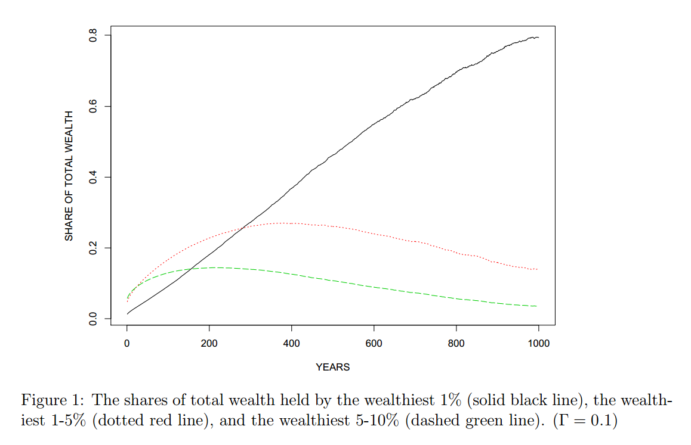

## Why Are You Here?

--- 

### Forbes 400 (2013) | How They Made Their Money?

<iframe src='assets/fig/unnamed-chunk-2.html'
                scrolling='no' seamless class='rChart dimple' id=iframe-chart28f469541409
                height=450 width = 900
                ></iframe>

<address class="text-muted">
    <a href = "http://www.forbes.com/sites/erincarlyle/2013/09/18/how-self-made-forbes-400-billionaires-earned-their-money/">
      How Self-Made Forbes 400 Billionaires Earned Their Money
    </a> 
    Erin Carlyle 
    Forbes September 18, 2013
</address>

--- dt:10

### Forbes 400 (2013) | How They Made Their Money? | Bar Chart

<iframe src='assets/fig/unnamed-chunk-3.html'
                scrolling='no' seamless class='rChart dimple' id=iframe-chart28f47572940
                height=450 width = 900
                ></iframe>

<address class="text-muted">
    <a href = "http://www.forbes.com/sites/erincarlyle/2013/09/18/how-self-made-forbes-400-billionaires-earned-their-money/">
      How Self-Made Forbes 400 Billionaires Earned Their Money
    </a> 
    Erin Carlyle 
    Forbes September 18, 2013
</address>

---

### More About Becoming Ultra-Wealthy

<iframe src='assets/fig/unnamed-chunk-4.html'
                scrolling='no' seamless class='rChart dimple' id=iframe-chart28f46a4b4a8e
                height=450 width = 620
                ></iframe>

  

  

      
    <blockquote style="font-size:80%;line-height:20px;">
    "Wealth mobility, it turns out, requires idiosyncratic risk, concentration, and (nonrecourse) leverage--all factors that MPT seeks to eliminate in a standard diversified portfolio."
    </blockquote>
  

<address class="text-muted">
    <a href = "A Risk-Based Asset Allocation Framework for Unstable Markets">
      A Risk-Based Asset Allocation Framework for Unstable Markets
    </a> 
    Ashvin B. Chhabra 
    CFA Article Collections for Practitioners 
    October 2013, Vol. 29, No. 4 
    (doi: 10.2469/cp.v29.n4.1)
</address>

---

### Luck and Skill in Wealth | Wealth Concentration

  

    </img>
  

  

      
    <blockquote style="font-size:80%;line-height:20px;">
    "In the absence of any redistribution, the distribution of wealth is unstable over time and becomes concentrated entirely at the top. This occurs despite the fact that all households have identical patience and skill."
    </blockquote>
  
  

<address class="text-muted">
    <a href ="http://www.ricardofernholz.com/Instability.pdf">
      Instability and Concentration in the Distribution of Wealth (Draft)
    </a> 
    Fernholz, R and R Fernholz 
    Claremont Mckenna College / Intech 
    December 9, 2103 
</address>

