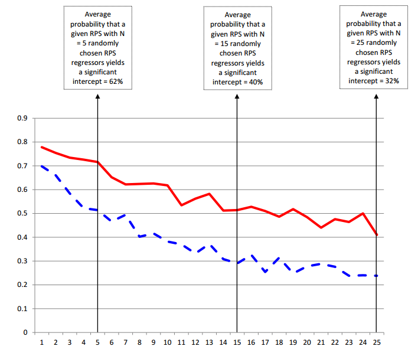
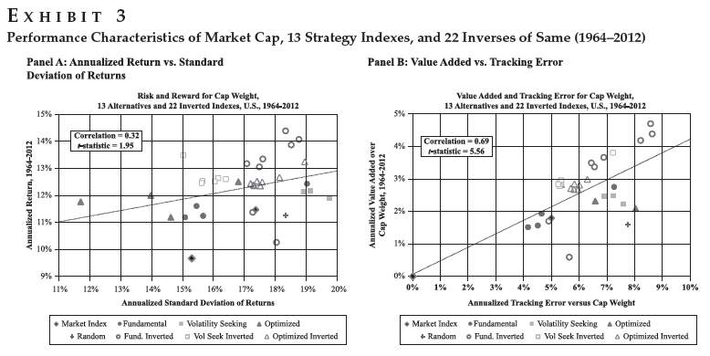

## Why Are You Here?

--- 

### Forbes 400 (2013) | How They Made Their Money?

<iframe src='assets/fig/unnamed-chunk-2.html'
                scrolling='no' seamless class='rChart dimple' id=iframe-chart27c85b5942f4
                height=450 width = 900
                ></iframe>

<address class="text-muted">
    <a href = "http://www.forbes.com/sites/erincarlyle/2013/09/18/how-self-made-forbes-400-billionaires-earned-their-money/">
      How Self-Made Forbes 400 Billionaires Earned Their Money
    </a> 
    Erin Carlyle 
    Forbes September 18, 2013
</address>

--- dt:10

### Forbes 400 (2013) | How They Made Their Money? | Bar Chart

<iframe src='assets/fig/unnamed-chunk-3.html'
                scrolling='no' seamless class='rChart dimple' id=iframe-chart27c8fa86c28
                height=450 width = 900
                ></iframe>

<address class="text-muted">
    <a href = "http://www.forbes.com/sites/erincarlyle/2013/09/18/how-self-made-forbes-400-billionaires-earned-their-money/">
      How Self-Made Forbes 400 Billionaires Earned Their Money
    </a> 
    Erin Carlyle 
    Forbes September 18, 2013
</address>

---

### More About Becoming Ultra-Wealthy

<iframe src='assets/fig/unnamed-chunk-4.html'
                scrolling='no' seamless class='rChart dimple' id=iframe-chart27c87db63a8
                height=450 width = 620
                ></iframe>

  

  

      
    <blockquote style="font-size:80%;line-height:20px;">
    "Wealth mobility, it turns out, requires idiosyncratic risk, concentration, and (nonrecourse) leverage--all factors that MPT seeks to eliminate in a standard diversified portfolio."
    </blockquote>
  

<address class="text-muted">
    <a href = "A Risk-Based Asset Allocation Framework for Unstable Markets">
      A Risk-Based Asset Allocation Framework for Unstable Markets
    </a> 
    Ashvin B. Chhabra 
    CFA Article Collections for Practitioners 
    October 2013, Vol. 29, No. 4 
    (doi: 10.2469/cp.v29.n4.1)
</address>

---

### Luck and Skill in Wealth | Wealth Concentration

  

    </img>
  

  

      
    <blockquote style="font-size:80%;line-height:20px;">
    "In the absence of any redistribution, the distribution of wealth is unstable over time and becomes concentrated entirely at the top. This occurs despite the fact that all households have identical patience and skill."
    </blockquote>
  
  

<address class="text-muted">
    <a href ="http://www.ricardofernholz.com/Instability.pdf">
      Instability and Concentration in the Distribution of Wealth (Draft)
    </a> 
    Fernholz, R and R Fernholz 
    Claremont Mckenna College / Intech 
    December 9, 2103 
</address>

---

### Luck and Skill in Wealth | Skill Continuum

  

     
    </img>
  

  

      
    <blockquote style="font-size:80%;line-height:20px;">
    "There are three aspects I will emphasize. The first is related to the number of players...second aspect is sample size...Finally, there's the aspect of how the game is scored."
    </blockquote>
  
  

<address class="text-muted">
    <a href ="http://analystreports.som.yale.edu/internal/F2013/MJ/Alpha%20and%20the%20Paradox%20of%20Skill.pdf">
      Luck and Skill Untangled: The Science of Success
    </a> 
    Interview with Michael J. Mauboussin 
    by Samuel Arbesman 
    Wired, November 16, 2012
</address>

---

### Luck and Skill in Wealth | Hope in 330 Signals

  

    </img>
  

  

      
    <blockquote style="font-size:80%;line-height:20px;">
    "the large number of RPS that we have documented...implies that either U.S. stock markets are pervasively inefficient, or that the number of rationally priced sources of risk in equity returns for theorists to understand and explain is far larger than previously envisaged."
    </blockquote>
  
  

<address class="text-muted">
    <a href ="http://ssrn.com/abstract=2062464">
      The Supraview of Return Predictive Signals
    </a> 
    Green, Jeremiah and Hand, John R. M. and Zhang, Frank 
    Review of Accounting Studies, Forthcoming
</address>

---

### Luck and Skill in Wealth | Hope in Blind Monkeys

  

    </img>
  

<address class="text-muted">
    <a href ="http://bit.ly/1bcOAh3">
      The Surprising Alpha from Malkiel's Monkey and Upside-Down Strategies
    </a> 
    Arnott, Robert D., et al.
    The Journal of Portfolio Management 39.4 (2013): 91-105.
</address>

---

### Luck and Skill in Wealth | Hope in Passive

  

    </img>
  

  

      

<address class="text-muted">
    <a href ="http://ibd.morningstar.com/article/article.asp?id=624328&CN=brf295,http://ibd.morningstar.com/archive/archive.asp?inputs=days=14;frmtId=12,%20brf295">
      A Bull Market in Passive Investing
    </a> 
    Adam Zoll 
    Morningstar 
    January 6, 2014
</address>

---

### Skill | How to Get It?

  

     
    </img>
  

  

      
    <blockquote style="font-size:80%;line-height:20px;">
    "But the data indicate that there is an enormous amount of variability in deliberate practice-even in elite performers.  One player in Gobet and Campitelli's (2007) chess sample took 26 years of serious involvement in chess to reach a master level, while another player took less than 2 years to reach this level."
    </blockquote>
  
  

<address class="text-muted">
    <a href =http://www.castonline.ilstu.edu/smith/405/readings_pdf/hambrick_deliberate_practice_2013.pdf">
      Deliberate practice: Is that all it takes to become an expert?
    </a> 
    Hambrick, David Z., et al. 
    Intelligence 
    
</address>

---

### Accumulated Advice

> - Open Source Yourself
> - Engage and Find a Mentor or Pair Learn with Peer
> - Practice Telling Stories / Produce Content
> - Learn to Program/Code
> - Fail and Get Used to Being Wrong

